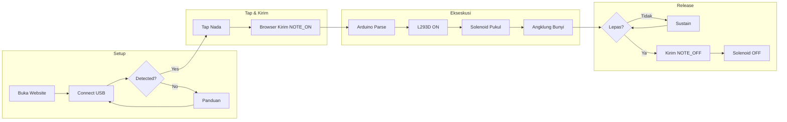
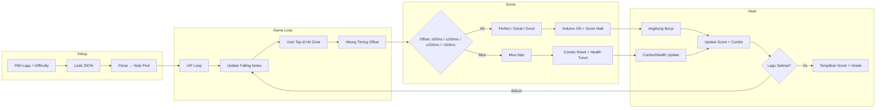
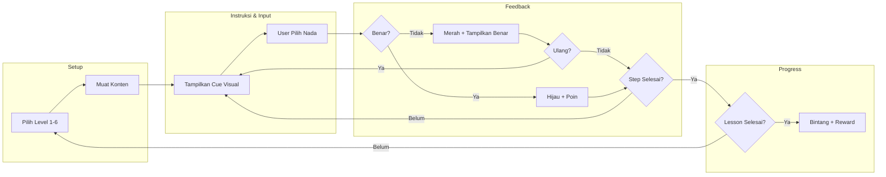

# AngklungineX Arc-2 — Slide Presentasi

> 15 slide siap pakai. Copy-paste ke Canva / PowerPoint / Google Slides.
> Mermaid code bisa di-import ke app.diagrams.net via Insert → Advanced → Mermaid.

---

## Slide 1: Apa Itu AngklungineX?

**AngklungineX** adalah **robot angklung cerdas** — angklung yang bisa bermain sendiri, dikendalikan lewat **game web**, atau dimainkan dengan **isyarat tangan**.

| Pertanyaan | Jawaban |
|-----------|---------|
| Apa bedanya dengan angklung biasa? | Sama-sama bambu asli, tapi tabungnya dipukul motor listrik, bukan digoyang tangan |
| Bagaimana cara memainkannya? | Buka website → sambungkan ke Arduino via USB → klik/tap nada di layar |
| Untuk apa dibuat? | Melestarikan angklung (warisan UNESCO) dengan cara modern yang menarik bagi generasi muda |

**Tiga Mode Permainan:**
- 🎹 **Free Play** — Virtual Piano untuk angklung 14 nada
- 🎮 **Rhythm Mode** — Guitar Hero dengan angklung asli
- 📚 **Learning Mode** — Belajar nada dari nol dengan panduan interaktif

---

## Slide 2: Upaya Pelestarian Angklung

| Pilar | Kontribusi AngklungineX |
|-------|------------------------|
| 🎮 **Gamifikasi Edukasi** | Learning Mode berbasis metode Kodály dalam format game interaktif |
| 🔬 **Inovasi Teknologi** | Robot angklung 14 nada yang bisa dimainkan via game web, gestur tangan, dan otomatis |
| 🌍 **Aksesibilitas Global** | Web-based (PWA) — bisa dicoba dari mana saja tanpa instalasi, cukup browser |
| 👶 **Regenerasi Digital** | Menarik minat Gen Z melalui rhythm game dengan angklung asli, bukan sekadar dokumentasi |

---

## Slide 3: Rumusan Masalah

1. **Bagaimana merancang sistem game web berbasis Web Serial API** yang mampu mengendalikan 14 aktuator robot angklung secara real-time (<50 ms latency) langsung dari browser tanpa middleware?

2. **Bagaimana mengimplementasikan rhythm game engine** (falling notes, timing detection, scoring, combo system) yang responsif dan edukatif sebagai media pembelajaran angklung?

3. **Bagaimana merancang kurikulum pembelajaran musik angklung berbasis metode Kodály** dalam format game progresif 6 level yang adaptif untuk pemula hingga mahir?

4. **Bagaimana mengintegrasikan tiga mode permainan (Free Play, Rhythm, Learning)** ke dalam satu platform web cross-platform yang mudah diakses tanpa instalasi perangkat lunak?

---

## Slide 4: Tujuan

| Tujuan | Deskripsi |
|--------|-----------|
| 🎯 **Platform Web 3-in-1** | Menghasilkan platform web AngklungineX dengan Free Play, Rhythm Mode, dan Learning Mode yang terintegrasi dengan robot angklung fisik 14 nada via Web Serial API |
| 📖 **Media Edukasi Modern** | Menyediakan media pembelajaran angklung yang gamified dan interaktif untuk mendukung pelestarian warisan budaya UNESCO |
| ⚡ **Game Engine Responsif** | Mengimplementasikan rhythm game engine dengan timing, scoring, combo multiplier, dan difficulty progression yang akurat dan real-time |
| 📚 **Kurikulum Kodály** | Merancang pembelajaran nada angklung berbasis metode Kodály dalam 6 level progresif dari pengenalan nada hingga sight reading |

---

## Slide 5: Manfaat Bermain Angklung

Bermain angklung tidak hanya melestarikan budaya, tetapi juga memberikan manfaat:

| Manfaat | Penjelasan |
|---------|-----------|
| 🧠 **Koordinasi Motorik** | Meningkatkan koordinasi antara tangan, mata, dan telinga |
| 💪 **Rasa Percaya Diri** | Bermain di depan umum melatih keberanian dan ekspresi diri |
| 🤝 **Kerja Sama Tim** | Angklung dimainkan bersama — melatih kesabaran dan sinkronisasi |
| 🌏 **Mengenal Budaya UNESCO** | Warisan budaya Indonesia yang diakui dunia |
| 😌 **Terapi Stres** | Bermain musik menyegarkan pikiran dan mengurangi stres |

---

## Slide 6: Cara Kerja — Free Play (Alur)



**Selesai release → user bisa tap nada lain (ulang dari B).**  
**Latensi target:** <20 ms (tap → bunyi)

---

## Slide 7: Cara Kerja — Rhythm Mode (Alur)



**Latensi target:** <50 ms

---

## Slide 8: Cara Kerja — Learning Mode (Alur)



---

## Slide 9: Cara Kerja — Alur Sistem Menyeluruh

```mermaid
flowchart LR
    subgraph A[Input]
        I[Tap / Mouse / Keyboard]
    end
    subgraph B[Browser App]
        b1[3 Game Mode]
        b2[Game Engine]
        b3[Web Serial API]
    end
    subgraph C[USB]
        U[115200 baud]
    end
    subgraph D[Arduino Mega]
        d1[Serial]
        d2[Parser]
        d3[PWM]
    end
    subgraph E[Hardware]
        e1[L293D x4]
        e2[Solenoid x14]
    end
    subgraph F[Output]
        O[Angklung 14 Nada]
    end
    I --> b1 --> b2 --> b3
    b3 --> U
    U --> d1 --> d2 --> d3
    d3 --> e1 --> e2
    e2 --> O
```



---

## Slide 10: Diagram Blok Sistem — Input → Process → Output

```mermaid
flowchart TB
    subgraph INPUT[Input]
        direction TB
        I1[Mouse / Touch / Keyboard]
        I2[Webcam]
        I3[Hand Gesture Recognition<br/>(MediaPipe di Browser)]
    end
    subgraph PROCESS[Process]
        direction TB
        P1[Browser App<br/>Game Engine + Web Serial API]
        P2[USB Serial 115200 baud]
        P3[Arduino Mega 2560<br/>Serial → Parser → PWM]
        P4[L293D Motor Driver ×4]
    end
    subgraph OUTPUT[Output]
        direction TB
        O1[Solenoid ×14]
        O2[Angklung 14 Nada<br/>(Suara Akustik Asli)]
    end
    subgraph POWER[Power]
        PW[PSU 12V 30A]
    end
    I1 --> P1
    I2 --> I3
    I3 --> P1
    P1 --> P2 --> P3 --> P4
    P4 --> O1 --> O2
    PW --> P3
    PW --> P4
```

---

## Slide 11: Spesifikasi Hardware

| Komponen | Spesifikasi | Fungsi |
|----------|-------------|--------|
| **Mikrokontroler** | Arduino Mega 2560 | Otak sistem — baca perintah, kendalikan motor |
| **Motor Driver** | L293D × 4 chip | 14 channel — atur arah & daya motor |
| **Aktuator** | Central Lock Solenoid × 14 | Pukul tabung angklung (seperti jari manusia) |
| **Angklung** | 14 nada (Sol rendah – Mi tinggi) | Sumber suara akustik asli (bukan speaker) |
| **Rangka** | Akrilik + 3D Print PLA+ | Dudukan angklung dan komponen |
| **Power Supply** | 12V 30A | Listrik utama — L293D & Arduino (via Vin) |

### Mapping 14 Nada

| No | Nada | Kode | Oktaf |
|----|------|------|-------|
| 1 | Sol Rendah | SOL1 | Rendah |
| 2 | La Rendah | LA1 | Rendah |
| 3 | Ti Rendah | TI1 | Rendah |
| 4 | Do | DO2 | Sedang |
| 5 | Re | RE2 | Sedang |
| 6 | Mi | MI2 | Sedang |
| 7 | Fa | FA2 | Sedang |
| 8 | Fis | FIS2 | Sedang (#) |
| 9 | Sol | SOL2 | Sedang |
| 10 | La | LA2 | Sedang |
| 11 | Ti | TI2 | Sedang |
| 12 | Do Tinggi | DO3 | Tinggi |
| 13 | Re Tinggi | RE3 | Tinggi |
| 14 | Mi Tinggi | MI3 | Tinggi |

---

## Slide 12: Rencana Pengembangan Arc-2

| 🚀 Foundation | 🎮 Rhythm Engine |
|:---|---:|
| Web Serial API + Arduino firmware | Chart system & parser JSON |
| Free Play Mode (14 tombol nada) | Falling notes + timing engine |
| Basic UI + koneksi USB | Scoring 4 tier + combo + health |
| ✅ **Progress:** Sedang | ✅ **Progress:** Sedang |

| 📚 Content | ✨ Polish & Future |
|:---|---:|
| Song Charts 10+ lagu nasional | UI responsive + animasi |
| Learning Mode 6 level Kodály | PWA offline support |
| 4 tingkat kesulitan | Hand Tracking web (post) |
| 🔴 **Progress:** Belum | 🔴 **Progress:** Rencana |

---

## Slide 13: Timeline Pengembangan — GitHub-style Grid

> Setiap baris = fitur. Kolom = bulan. 🟩 = pengerjaan aktif di bulan itu.

| Task | Jan | Feb | Mar | Apr | Mei | Jun |
|------|:---:|:---:|:---:|:---:|:---:|:---:|
| **Web Serial + Arduino** | 🟩 | 🟩 | | | | |
| **Free Play Mode** | 🟩 | 🟩 | 🟩 | | | |
| **Chart System + Parser** | | 🟩 | 🟩 | | | |
| **Core Gameplay Engine** | | | 🟩 | 🟩 | | |
| **Rhythm Mode v1** | | | | 🟩 | | |
| **Song Charts 10 Lagu** | | | | | 🟩 | 🟩 |
| **Learning Mode 6 Level** | | | | | 🟩 | 🟩 |
| **UI/UX + Animasi** | | | | | | 🟩 |
| **PWA + Alpha Test + Dok** | | | | | | 🟩 |

**Status per Bulan:**

| Bulan | Isi Pekerjaan | Capaian |
|-------|---------------|---------|
| **Jan** | Web Serial API, Arduino Firmware, Free Play (mulai) | Angklung bisa bunyi dari klik web ✅ |
| **Feb** | Free Play (lanjut), Chart JSON, Song Selection UI, Timing Engine | Free Play stabil + Chart format siap |
| **Mar** | Falling Notes, Hit Zone, Timing Offset, Score dasar | Notes jatuh bisa dimainkan |
| **Apr** | Combo, Health Bar, Flow Game, Result Screen | Rhythm Mode end-to-end siap |
| **Mei** | 10 Song Charts, Learning Mode 6 level | Konten ajar + lagu siap |
| **Jun** | UI Responsive, Animasi, PWA, Alpha Test, Dokumentasi | Aplikasi siap demo + publikasi |

---

## Slide 14: Skenario Penggunaan

| Siapa | Bagaimana | Manfaat |
|-------|-----------|---------|
| 👨‍🎓 **Siswa/Siswi** | Bermain Rhythm Mode di kelas | Belajar nada sambil seru-seruan |
| 👩‍🏫 **Guru Musik** | Menggunakan Learning Mode | Media ajar angklung yang interaktif |
| 🏛️ **Pengunjung Exhibition** | Free Play + Auto Play | Mencoba angklung tanpa perlu bisa main |
| 👨‍💻 **Developer/Engineer** | Mengeksplorasi Web Serial API | Inspirasi proyek teknologi budaya |
| 🎵 **Kolektor/Musisi** | Free Play untuk eksperimen nada | Alternatif angklung otomatis |

---

## Slide 15: Tim Pengembang

| Nama | Role | Fokus |
|------|------|-------|
| **Yuddha Wastu Pramukha** | Ketua / Full Stack | Web app, Arduino, arsitektur sistem |
| **Muhammad Farel Firdaus** | Frontend | UI/UX, antarmuka game |
| **Reisya Putri Ramadhani** | Game Design | Konten pembelajaran, dokumentasi |
| **Adinda Candra Putri** | Backend/Testing | Database, quality assurance |
| **Fauzan Ramadhan** | Hardware | Perawatan mekanik, 3D print |

**Dosen Pembimbing:** *(TBD)*

**Alumni Arc-1 (PKM-KC 2025):** Rainova, Shandy, Melvina, Yuddha — *terima kasih atas fondasi yang telah dibangun.*

---

**Institut Teknologi Nasional Bandung** — I-Will Laboratory  
PKM-KC 2025 dilanjutkan Pengembangan 2026
