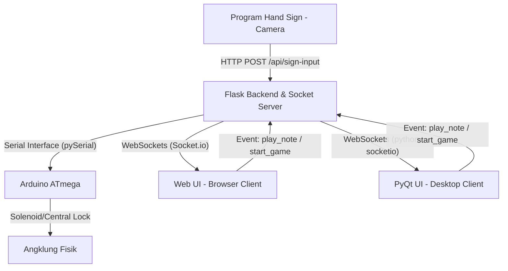

# Spesifikasi Desain Arsitektur Backend: AngklungineX (Upgrade)

Dokumen ini berisi rancangan arsitektur dan spesifikasi sistem backend untuk peningkatan (upgrade) proyek **AngklungineX**—sebuah angklung digital interaktif yang dikendalikan melalui deteksi gerakan tangan (*Kodaly hand sign*) dengan *output* fisik berupa angklung mekanik yang digerakkan oleh Arduino.

---

## 1. Ikhtisar Sistem (System Overview)

Proyek AngklungineX memiliki tujuan utama untuk memainkan angklung fisik secara digital menggunakan tangkapan kamera (*hand sign*). Upgrade sistem ini mencakup penambahan dari 8 nada menjadi **14 nada** dan penyediaan **tiga mode interaktif**:
1.  **Free Play**: Bermain bebas menggunakan deteksi gerakan (*camera*) maupun input *keyboard* komputer (virtual piano style).
2.  **Challenge Mode**: Game ritme (seperti Guitar Hero) di mana user memukul angklung sesuai dengan nada yang jatuh di layar untuk mengumpulkan skor.
3.  **Learn Mode**: Modul pembelajaran interaktif langkah-demi-langkah untuk mengedukasi cara menggunakan sistem dan memperagakan hand sign.

Sistem akan dikembangkan dengan prinsip **"Single Backend, Dual Client"** menggunakan Python Flask untuk menyajikan dua antarmuka (GUI) dengan fitur setara: **Web UI** dan **PyQt Desktop UI**.

---

## 2. Arsitektur Sistem & Komponen

Sistem berjalan secara lokal pada satu PC yang sama (Local PC) untuk meminimalkan keterlambatan waktu (*latency*).



### Komponen Utama:
1.  **Flask Backend (Python)**:
    *   Berperan sebagai *Single Source of Truth*. Mengelola komunikasi serial ke Arduino, memproses sinyal hand sign masuk, serta mengontrol logika *game state* dasar (seperti penyediaan data lagu).
    *   Menggunakan **Flask-SocketIO** untuk komunikasi dua arah secara real-time dengan Web UI dan PyQt.
2.  **Web UI (HTML/CSS/JS)**:
    *   Diakses lokal melalui web browser. Menggunakan `socket.io-client` untuk sinkronisasi nada dan skor secara real-time.
3.  **PyQt Desktop UI (Python)**:
    *   GUI desktop berbasis Python Qt. Menggunakan `python-socketio` untuk bertindak sebagai WebSocket client yang terhubung ke Flask, memastikan fungsionalitasnya sama persis dengan Web UI.
4.  **Hand Sign Detector (Camera Process)**:
    *   Aplikasi kamera terpisah yang mendeteksi gerakan koordinat tangan dan mengirimkan nada terdeteksi ke backend melalui endpoint HTTP POST lokal (`/api/sign-input`).
5.  **Arduino Controller**:
    *   Pengendali hardware pasif yang menerima sinyal ketukan nada dari Flask Backend melalui koneksi USB Serial (COM port) dan meneruskannya ke aktuator *central lock* angklung.

---

## 3. Protokol Komunikasi & WebSocket Events

Untuk sinkronisasi real-time antar-proses, WebSocket digunakan sebagai jalur komunikasi utama. Berikut daftar event WebSocket yang disepakati:

| Nama Event | Arah | Payload | Deskripsi |
| :--- | :--- | :--- | :--- |
| `connect_status` | Server -> Client | `{"arduino": bool, "camera": bool}` | Mengirimkan status koneksi hardware ke antarmuka pengguna. |
| `play_note` | Client -> Server | `{"note": string}` | Dikirim oleh Client saat tombol keyboard ditekan untuk memicu suara fisik angklung. |
| `note_played` | Server -> Client | `{"note": string, "source": string}` | Dikirim ke semua client saat nada terdeteksi (baik dari keyboard atau kamera). |
| `load_songs` | Client -> Server | - | Meminta daftar lagu untuk Challenge Mode. |
| `song_list` | Server -> Client | `[{"id": 1, "title": "Gundul Pacul", "notes_file": "gundul.json"}]` | Mengirim daftar lagu yang tersedia di backend. |

---

## 4. Alur Kerja Deteksi & Ketepatan Nada (Challenge Mode)

Dalam game bergenre ritme (Guitar Hero style), keakuratan *timing* visual sangat sensitif. Oleh karena itu, logika pencocokan ketukan (*hit detection*) didelegasikan ke sisi **Client (Web/PyQt UI)** untuk meminimalkan delay visual.

### Langkah Aliran Challenge Mode:
1.  User memilih lagu dan memulai permainan dari GUI.
2.  GUI membaca file nada lagu (format waktu dan nama nada, misal: `{"time": 2.5, "note": "C4"}`).
3.  GUI menjalankan animasi visual nada jatuh menuju garis target.
4.  Ketika user membuat *hand sign* di depan kamera:
    *   *Hand Sign Detector* mendeteksi nada (misal: "C4") -> mengirim POST ke Backend Flask -> Backend Flask mengirim perintah Serial ke Arduino -> Arduino memukul angklung C4 secara fisik.
    *   Di saat yang sama, Backend Flask mengirimkan event WebSocket `note_played` dengan payload `{"note": "C4", "source": "gesture"}` ke GUI.
5.  GUI menerima event `note_played`, lalu memeriksa apakah ada nada "C4" visual yang sedang berada di area target deteksi (dalam batas waktu presisi, misalnya ±150ms).
    *   Jika **Ya**: Berikan efek visual "Hit", tambah skor, dan tingkatkan kombo.
    *   Jika **Tidak**: Biarkan nada visual lewat dan catat sebagai "Miss" jika melewati garis tanpa dipukul.

---

## 5. Penanganan Error & Mode Simulasi (Resilience & Simulation)

Untuk mencegah kemacetan demo dan mempercepat pengembangan mandiri tanpa hardware, sistem dirancang dengan beberapa mekanisme ketahanan:

### A. Fitur Auto-Reconnect & Fallback Arduino
*   Jika koneksi USB Serial terputus (kabel longgar), modul `SerialManager` pada Flask Backend tidak akan menghentikan program utama.
*   Backend akan mencoba mendeteksi ulang port serial secara otomatis setiap 3 detik.
*   Jika Arduino terputus, backend mengirimkan event `connect_status` dengan status `"arduino": false`. GUI akan mendeteksi status ini dan menampilkan pesan peringatan di layar kepada operator, serta otomatis beralih ke **Fallback Mode** (menampilkan animasi visual saja tanpa memicu kegagalan sistem).

### B. Mode Simulasi Perangkat Keras
Dua jenis simulator akan dibuat untuk membantu pengujian mandiri:
1.  **Arduino Serial Simulator**:
    *   Dikonfigurasi melalui file `.env` dengan variabel `SIMULATE_ARDUINO=True`.
    *   Jika aktif, koneksi fisik serial dilewati dan backend hanya akan menampilkan teks log debug: `[SIMULATION] Arduino trigger pin untuk nada <NOTE>`.
2.  **Debug Inputs Panel (GUI Simulator)**:
    *   Di sisi GUI (Web/PyQt), disediakan panel kontrol debug tersembunyi yang berisi 14 tombol simulasi nada.
    *   Menekan tombol di panel debug ini akan memicu event WebSocket seolah-olah kamera mendeteksi gerakan tangan tersebut secara instan. Berguna untuk menguji alur belajar (*Learn Mode*) dan sinkronisasi game (*Challenge Mode*).

---

## 6. Struktur Skema File Lagu (JSON)

Setiap lagu disimpan di direktori backend dalam format JSON sederhana untuk mempermudah pemeliharaan daftar lagu:

```json
{
  "title": "Ibu Kita Kartini",
  "tempo": 80,
  "difficulty": "Easy",
  "notes": [
    { "timestamp_ms": 1000, "note": "C4" },
    { "timestamp_ms": 2000, "note": "D4" },
    { "timestamp_ms": 3000, "note": "E4" },
    { "timestamp_ms": 3500, "note": "F4" },
    { "timestamp_ms": 4500, "note": "G4" }
  ]
}
```

---

## 7. Rencana Pengembangan Bertahap (Next Steps)

Setelah arsitektur ini disetujui oleh tim, langkah pengembangan selanjutnya adalah:
1.  **Setup Boilerplate Backend**: Inisialisasi server Flask-SocketIO dengan struktur modul `SerialManager` dan `SocketManager` yang terisolasi.
2.  **Pembuatan Mock Simulator**: Membuat simulasi pengiriman input nada dan penerimaan data serial.
3.  **Pengembangan Web UI & PyQt GUI (secara paralel)**: Menyambungkan antarmuka ke server WebSocket lokal.
4.  **Integrasi Hardware & Uji Coba Lapangan**: Menghubungkan langsung dengan modul kamera sesi 1 dan Arduino ATmega fisik.
